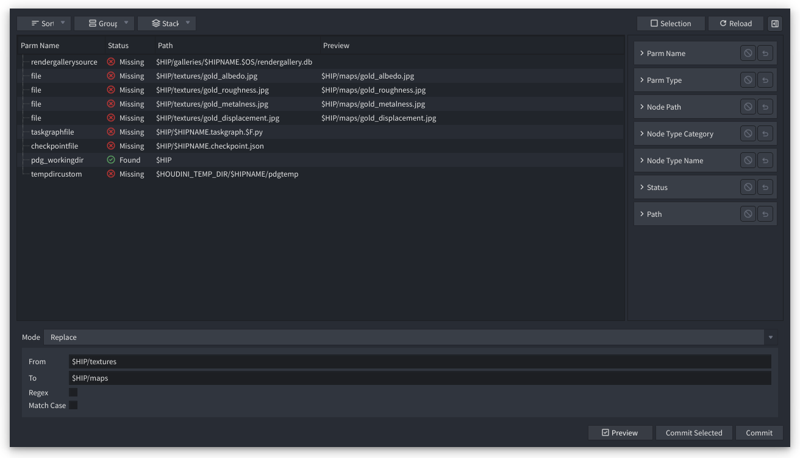

# Houdini Path Manager

[](https://github.com/beatreichenbach/houdini-pathmanager/releases)
[](https://github.com/beatreichenbach/houdini-pathmanager)
[](https://github.com/beatreichenbach/houdini-pathmanager/blob/main/LICENSE)
[](https://github.com/astral-sh/ruff)
[](https://github.com/astral-sh/ty)

Path Manager is a tool for SideFX Houdini to manage file paths. It allows the user to replace and change paths,
and copy or move files.



## Installation
 
Path Manager is installed as a Houdini Package.

1. Go to the [Releases](https://github.com/beatreichenbach/houdini-pathmanager/releases) page and download the latest `pathmanager.zip`.
2. Navigate to your Houdini user preferences folder: `$HOME/houdini‹X›.‹Y›`
3. If you don't have a folder named `packages` in that directory, create it.
4. Extract the contents of the `.zip` file into the `packages` folder.
5. Restart Houdini. You can verify the installation by opening the **Package Browser** (**Windows > Package Browser**) and ensuring "Path Manager" is listed.

**Example Folder Structure:**
```text
├── houdini21.0
    ├── packages/
        ├── pathmanager.json
        └── /pathmanager
            └── (package files)
```

## License

MIT License. Copyright 2026 - Beat Reichenbach. See the [License file](LICENSE) for details.
